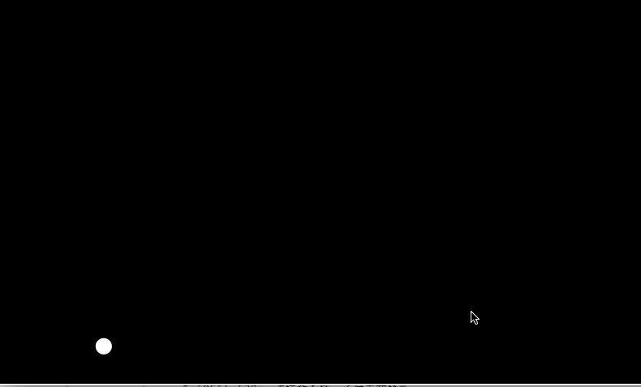

# 1_移动小球

源码<https://github.com/mzkmzk/Canvas/tree/v0.1_complete_ball_more/demo/shoot_game>

尝鲜在线版<http://canvas.404mzk.com/shoot_game/html/1_base.html>

# 1. 定义Canvas
```html
<canvas id="base_1"></canvas>
```
# 2. 初始化

初始化主要有

1. 初始化画布
2. 准备清除画布函数
3. 注册键盘监听事件

```javascript
var base_1 = document.getElementById('base_1');

//定义canvas的宽度,和定义背景为黑色
base_1.width = document.body.scrollWidth;
base_1.height = document.body.scrollHeight;
var ctx = base_1.getContext('2d');

/**
 * 清除画布
 */
function clear_base_1 (){
    ctx.fillStyle = "black";
    ctx.fillRect(0, 0, base_1.width, base_1.height); //还原掉上次的白色球
}

clear_base_1();

/**
 * 注册键盘监听事件
 */
KeyPress.init();
```


# 3. 小球数据结构

```javascript
vae Lead = {
    /**
     * x坐标
     */
    x: 15,
    /**
     * y坐标
     */
    y: document.body.scrollHeight - 15,
    /**
     * 半径
     */
    radius: 10,
    /**
     * 加速度
     */
    ACCELERATED_VELOCITY: 0.09,
    /**
     * 初始速度
     */
    velocity: {'x':0,'y':0},
    /**
     * 最大速度
     */
    MAX_VELOCITY: 3,
    /**
     * 记录wasd是否被按
     */
    more_direction: [],
    ...
}
```

# 4. 移动逻辑

Canvas中更新状态是全局变化,就是我的小球要移动

1. 必须把前一次的画布清除,即重绘背景
2. 重新把小球定义到要移动的位置

canvas主要通过定时器更新画布

```javascript
loop_game();
function loop_game() {
    Lead.draw_screen();
    window.setTimeout(loop_game, 1000/40);
}
```

这里主要是执行draw_screen();

```javascript
var Lead = {
    //数据结构
    ...
    draw_screen: function(){
        clear_base_1();
        this.change_velocity();
        this.more();
        this.draw_ball();
    }
}

```

draw_screen要执行的操作有

1. 清空画布
2. 判断按键,计算小球速度

    ```javascript
    var Lead = {
        ...
        change_velocity: function() {
          if (this.more_direction[65] === true) {
              this.more_left();
          }
          if (this.more_direction[68] === true) {
              this.more_right();
          }
          if (this.more_direction[83] === true) {
              this.more_up();
          }
          if (this.more_direction[87] === true) {
              this.more_down();
          }
      },
      more_left: function(){
          this.velocity['x'] -= this.ACCELERATED_VELOCITY;
      },
      more_right: function(){
          this.velocity['x'] += this.ACCELERATED_VELOCITY;
      },
      more_up: function(){
          this.velocity['y'] += this.ACCELERATED_VELOCITY;
      },
      more_down: function(){
          this.velocity['y'] -= this.ACCELERATED_VELOCITY;
      },
          ...
      }
      ```
3. 根据小球速度,计算小球下次该出现的坐标

    ```javascript
    vae Lead = {
      ...
       more: function() {
          this.x += this.velocity['x'];
          this.y += this.velocity['y'];
      },
      ...
    }
    ```
4. 画出小球

    ```javascript
    draw_ball: function(){
          ctx.beginPath();
          ctx.fillStyle = 'white';
          ctx.arc(this.x +this.radius, this.y+this.radius, 10, 0, Math.PI * 2, true);
          ctx.closePath();
          ctx.fill();
      },
  ```

# 5.键盘监听

```javascript
var KeyPress = {
    init_key_up: function() {
        document.onkeyup = function(e) {
            e = e || window.event;
            Lead.more_direction[e.keyCode] = false;
        }
    },
    init_key_down: function() {
        document.onkeydown = function(e) {
            e = e || window.evnet;
            Lead.more_direction[e.keyCode] = true;
        }
    },
    init: function(){
        this.init_key_down();
        this.init_key_up();
    }
}
```

# 6 展示




