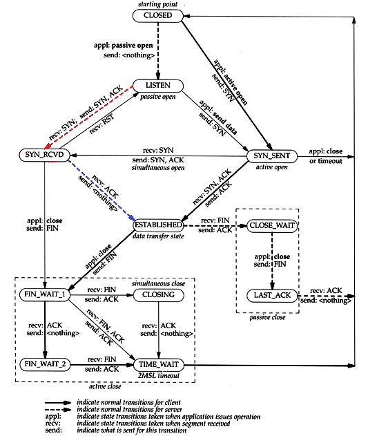

# Mac搭建代理,实现共享hosts

# 故事

因为测试服务器和正式服务器用的是一样的ip,通过修改hosts

有的公司喜欢把测试和正式域名分开,有的喜欢弄一块

弄一块的好处

1. 例如这个url写在APP里,这样调试的想切换环境,只需切换wifi环境即可
2. 有很多url不用特殊处理,都和正式一样就可以了

弄一块坏处

1. 其他人员(产品)要看测试环境也要配hosts,会比测试要麻烦一点

不弄一块的好处和坏处与弄一块相反

# 设置

这里主要用到privoxy  

1. brew install privoxy  
2. ln -sfv /usr/local/opt/privoxy/*.plist ~/Library/LaunchAgents  //放到开机项里
3. launchctl load ~/Library/LaunchAgents/homebrew.mxcl.privoxy.plist  
4. vim /usr/local/etc/privoxy/config  

  1. listen-address  0.0.0.0:8118    #8118是 privoxy 的监听端口  
  2. forward-socks5t   /               127.0.0.1:1080 .    #1080是 shadowsocks 的监听端口  可以不用设置
5. privoxy /usr/local/etc/privoxy/config //重启privoxy
6. 检查监听接口
    
    ```shell
     ~  netstat -an |grep 8118
    tcp4       0      0  192.168.105.70.8118    172.16.32.111.56374    SYN_RCVD
    tcp4       0     31  192.168.105.70.8118    192.168.2.8.56328      FIN_WAIT_1
    tcp4       0      0  *.8118                 *.*                    LISTEN
    tcp4       0      0  127.0.0.1.8118         *.*                    LISTEN
    ```
    最下面两个是监听的,而上面的是正在使用服务的ip
7.  手机设置: 首先要在同一局域网,一般你PC能ping通手机即可,然后设置HTTP代理ip为你本地ip,端口为8118即可


http://daviswang.iteye.com/blog/819176

# SYN_RCVD

我在想,如果只要能互相访问到,应该就能使用我的HTTP代理

然后我连了公司的另外一个wifi,然后出现

```shell
tcp4       0      0  192.168.105.70.8118    172.11.111.105.51693    SYN_RCVD
tcp4       0      0  *.8118                 *.*                    LISTEN
```

SYN_RCVD,然后网页是无法打开的

参考http://daviswang.iteye.com/blog/819176

这个原因应该是在只配置了DNAT而不进行SNAT的服务网络环境下容易出现，主要是由于inbound（SYN包）和outbound（[SYN,ACK]包）的包穿越了不同的网关/防火墙/负载均衡器，从而导致[SYN,ACK]路由到互联网的源地址（一般是防火墙的出口地址）与SYN包的目的地址（服务的虚拟IP)不同，这时客户机无法将SYN包和[SYN,ACK]包关联在一起，从而会认为已发出的SYN包还没有被应答，于是继续等待应答包。这样服务器端的连接一直保持在SYN_RCVD状态（半开连接）直到超时。  

待我抓抓包验证一下

TCP的好图




# 参考

基本配置: http://liuhonghe.me/mac-set-shadowsocks-share-lan.html


