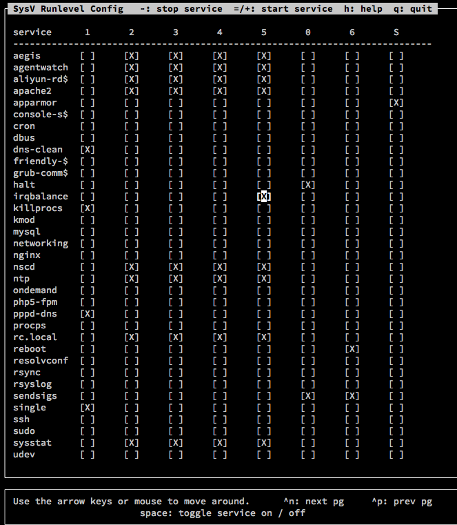

# 命令开机执行

# 主要方法

1. ln -s 在/etc/rc*.id(*代表0~6的运行级别),这里都是软链接,真正的会放在/etc/init.d/,(Ubuntu)
2. chkonfig 命令运行级别设置
3. ntsysv 伪图形运行级别设置

# 1. 启动软链接

可以在/etc/init.d中写好脚本

然后ln -s 过去想要的运行级别中

例如

`[root@localhost ~]# ln -s /etc/init.d/sshd /etc/rc.d/rc3.d/S100ssh`

但是例如看看/etc/rc0.d

```shell
work@iZ94fnej0x9Z:/etc/rc0.d$ ll
total 12
drwxr-xr-x  2 root root 4096 Sep 19 23:47 ./
drwxr-xr-x 95 root root 4096 Oct 13 09:26 ../
lrwxrwxrwx  1 root root   17 Dec 31  2015 K09apache2 -> ../init.d/apache2*
lrwxrwxrwx  1 root root   29 Sep 19 23:47 K10unattended-upgrades -> ../init.d/unattended-upgrades*
lrwxrwxrwx  1 root root   20 Dec 15  2015 K20agentwatch -> ../init.d/agentwatch*
lrwxrwxrwx  1 root root   22 Dec 15  2015 K20aliyun-rdate -> ../init.d/aliyun-rdate*
lrwxrwxrwx  1 root root   14 Aug 11  2014 K20nscd -> ../init.d/nscd*
lrwxrwxrwx  1 root root   15 Aug 11  2014 K20rsync -> ../init.d/rsync*
-rw-r--r--  1 root root  353 Mar 13  2014 README
lrwxrwxrwx  1 root root   18 Aug 11  2014 S20sendsigs -> ../init.d/sendsigs*
lrwxrwxrwx  1 root root   17 Aug 11  2014 S30urandom -> ../init.d/urandom*
lrwxrwxrwx  1 root root   22 Aug 11  2014 S31umountnfs.sh -> ../init.d/umountnfs.sh*
lrwxrwxrwx  1 root root   18 Aug 11  2014 S40umountfs -> ../init.d/umountfs*
lrwxrwxrwx  1 root root   20 Aug 11  2014 S60umountroot -> ../init.d/umountroot*
lrwxrwxrwx  1 root root   14 Aug 11  2014 S90halt -> ../init.d/halt*
```

会设置名称

K开头的脚本文件表示运行级别加载时要关闭的,S开头是需要执行的

# sysv-rc-conf

sysv-rc-conf是Ubuntu用于替代chkconfig



命令

```shell
sysv-rc-conf --list apache2
sysv-rc-conf apache2 on
```

# 开机执行自己的命令

sudo vim /etc/rc.local

在exit前写下你要执行的命令即可

不过这样执行的用户是谁 root吗?

重启后,如果父进程ID为1的话,应该就是init进程产生的,所以也就应该是root用户

但是服务器不敢重启///所以这个疑问待检测


# 参考链接

<http://www.cnblogs.com/nerxious/archive/2013/01/18/2866548.html>