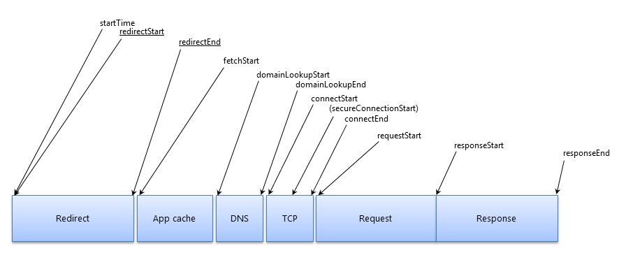

# performance

这是一个用来研究网络加载时间的api

IE9+才支持,http://caniuse.com/#feat=nav-timing

开始之前,建议先随便打开个网页,在console稍微体验一下

1. 了解大概有的属性: performance
2. 网页加载的时间: performance.timing
3. 每个请求所耗费的事件: performance.getEntries()

timing和getEntries有很多一样的属性,但是还是有些不一样的

# timing专属属性

1. navigationStart: 前一个页面(不一定同域)unload的时间戳,若无前一页,则与fetchStart值相等
2. unloadEventStart: 前一个页面(同域)unload回调开始的时间戳,若无前一页,则值为0
3. unloadEventEnd: 前一个页面(同域)unload回调结束的时间戳,若无前一页,则值为0
4. domLoading: 开始渲染DOM树的时间,此时document.readyState变为loading(抛出readystatechange事件)
5. domInteractive: 完成解析DOM树的时间,此时document.readyState变成Interactive(抛出readystatechange事件),(此时还没开始加载网页内的资源)
6. domContentLoadedEventStart: DOM解析完成后,网页内资源开始加载的时间
7. domContentLoadedEventEnd: DOM解析完毕并且网页内资源加载完毕
8. domComplete: don解析完成,资源也准备就绪的时间,document.readystate变成complete
9. loadEventStart: load事件传送给文档,也是load回调函数执行的时间,若无load事件,则为0
10. loadEventEnd: load事件回调函数执行完毕的时间

# getEntries返回对象的专属属性

1. name: 资源绝对路径
2. entrtType: 表名在哪个performance对象中获取的(未成熟),这个属性参考https://developer.mozilla.org/en-US/docs/Web/API/PerformanceEntry/entryType
3. initiatorType: 谁发起的请求,link|script|redirect
4. duration: 加载时间

# 资源请求类型

这里以timing举例,说明下整个timing下来可以获得的时间戳

网上被复用了很多次的图

这个图没有举出timing有关DOM的时间,而是把网络相关的时间戳举了出来

这里把dom和网络相关的时间戳都排下序

1. navigationStart
2. unloadEventStart
3. unloadEventEnd
4. redirectStart: 第一个重定向发生的时间,有跳转且同域才算,否则为0
5. redirectEnd: 最后一个重定向完成的时间,有跳转且同域才算,否则为0
6. fetchStart: 浏览器准备好使用HTTP请求抓取文档的时间,发生在检查本地缓存之前
7. 

# tips

使用的时候需要注意的点

1. 资源如果是第三方加载的话,若没加上`Timing-Allow-Origin: *`头们只能获取持续时间(但是笔者亲测好像没这个问题)

# 参考链接

1. http://www.alloyteam.com/2015/09/explore-performance/
2. http://www.html-js.com/article/Brief-introduction-of-JavaScript-Resource-Timing-API-to-learn-something-every-day
