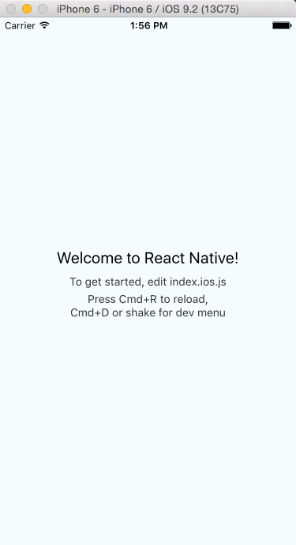

 # 入门

# 环境搭建

1. sudo npm install -g react-native-cli
2. 安装好Xcode
3. 切换淘宝源,不然npm很慢

  ```shell
  //default
   ~/Learning/iOS_APP: npm config get registry
https://registry.npmjs.org/
 ~/Learning/iOS_APP: npm config get disturl
undefined
  //设置
  npm config set registry https://registry.npm.taobao.org --global
npm config set disturl https://npm.taobao.org/dist --global
  ```
  
# 第一个ReactNative iOS App

```shell
react-native init AwesomeProject
...
To run your app on iOS:
   cd /Users/maizhikun/Learning/iOS_APP/AwesomeProject
   react-native run-ios
   - or -
   Open /Users/maizhikun/Learning/iOS_APP/AwesomeProject/ios/AwesomeProject.xcodeproj in Xcode
   Hit the Run button
To run your app on Android:
   Have an Android emulator running (quickest way to get started), or a device connected
   cd /Users/maizhikun/Learning/iOS_APP/AwesomeProject
   react-native run-android
   
   
cd AwesomeProject
react-native run-ios
```

# 运行第一个APP

我在这里直接运行 react-native run-ios是会报错的...
```shell
 ~/Learning/ReactNative/AwesomeProject:  react-native run-ios
Found Xcode project AwesomeProject.xcodeproj
xcrun: error: unable to find utility "instruments", not a developer tool or in PATH

Command failed: xcrun instruments -s
xcrun: error: unable to find utility "instruments", not a developer tool or in PATH
```

然后参考<http://bbs.reactnative.cn/topic/2768/xcrun-error-unable-to-find-utility-instruments-not-a-developer-tool-or-in-path>

输入`sudo xcode-select -s /Applications/Xcode.app/Contents/Developer/`然后就可以运行react-native run-ios了

或者通过xcode打开`AwesomeProject.xcodeproj`

但是上诉两种方式都会有编译错误

```shell
Property 'force' not found on object of type 'UITouch'
```

解决方案: 升级Xcode,之前失败时的版本忘了,现在升级到了`Version 7.2.1 (7C1002)`,就行了,应该是组件应该包含到iOS9.0 Simulator




# 参考文档

1. <https://facebook.github.io/react-native/>