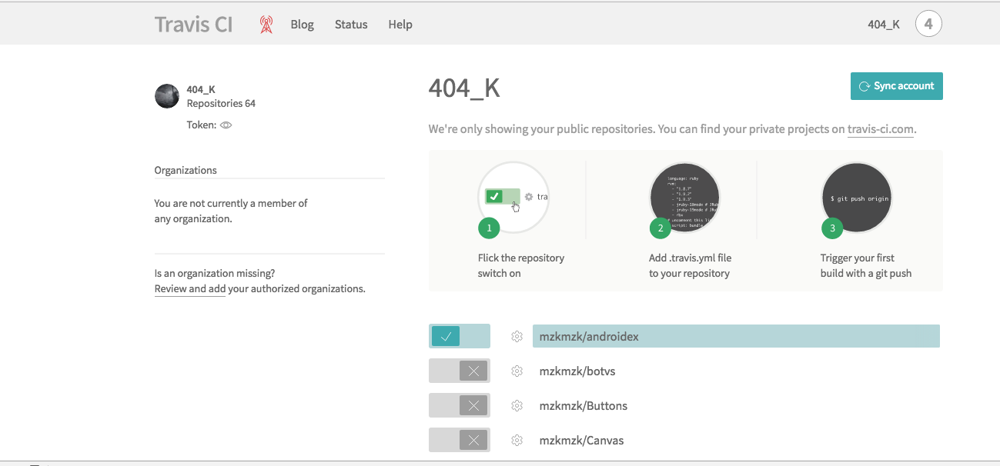
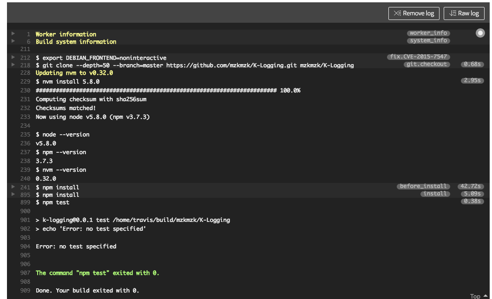

# 入门DEMO

# travis-ci.org

首先上travis-ci.org和github进行关联




travis-ci.org会把你的responsitory全都显示出来,把你想进行自动构建的的项目勾选上就可以了

> tips: travis会让构建需要时长超过20分钟的项目自动失败

然后travis-ci就会自动寻找你项目根目录下的.travis.yml进行构建

# travis.yml

基本的包含元素

1. Install apt addons
2. before_install
3. install
4. before_script
5. script
6. after_success or after_failure
7. OPTIONAL before_deploy
8. OPTIONAL deploy
9. OPTIONAL after_deploy
10. after_script

可以在这里选择自己的语言进行了解<https://docs.travis-ci.com/user/customizing-the-build/#Specifying-Runtime-Versions>

在<https://github.com/mzkmzk/K-Logging>中,最开始为

```bash
sudo: required
dist: trusty
language: node_js
node_js:
  - "5.8.0"
before_install: 
-
  npm install
```

其实这样的构建基本是百分百pass的,因为没有进行test,而只是进行了npm install了而已



但其实traivsu也识别出了执行npm test是没有测试的


# 在github上引用标识

只要在README.md上添加

```bash
[](https://travis-ci.org/[YOUR_GITHUB_USERNAME]/[YOUR_PROJECT_NAME])
```
即可

例如我的<https://github.com/mzkmzk/K-Logging>

就写的是`[](https://travis-ci.org/mzkmzk/K-Logging)
`

这里就把travis引入到js的github代码库上进行了讲解

本文没说到,但也是自动集成最重要的自动画测试,敬请期待

# 参考链接

1. travis.yml基本介绍: https://docs.travis-ci.com/user/customizing-the-build/
2. js引入travis的基本结束: https://docs.travis-ci.com/user/languages/javascript-with-nodejs/#Choosing-Node-versions-to-test-against